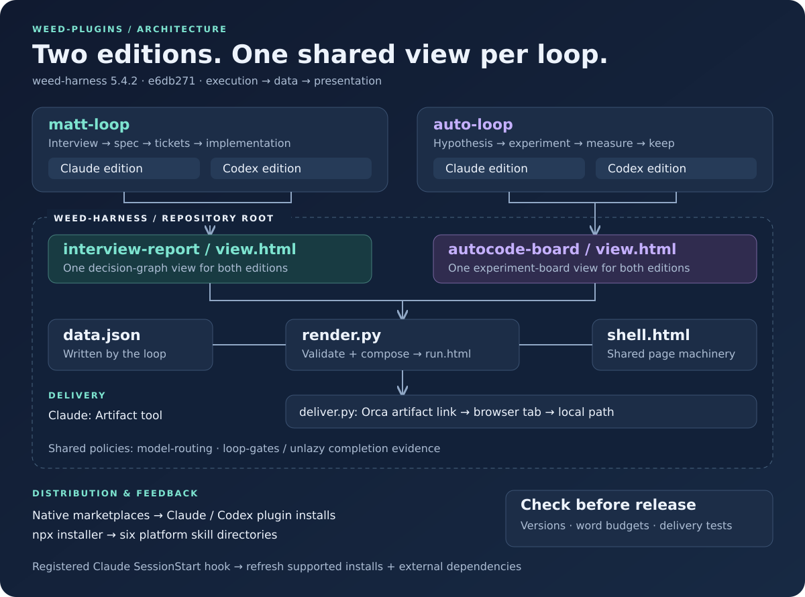

# weed-plugins

One repo, per-loop plugins. An AI-CLI harness by weedmo — installable skill packs
for **Claude Code, Codex, opencode, gemini-cli, and Orca**.

| Plugin | Where | What | Required |
|--------|-------|------|----------|
| `weed-harness` | repo root | The shared runtime every loop builds on — `loop-report` (live progress page; Artifact on Claude Code, Orca delivery elsewhere), `interview-report` and `autocode-board` (the loops' page views), `model-routing` (Codex-side model/effort tiers), `loop-gates` (unlazy-backed completion) — plus the Claude Code-only setup, hooks, and HUD | yes, every platform |
| `matt-loop` | `plugins/matt-loop-claude/` · `plugins/matt-loop-codex/` | matt-auto + vendored Matt Pocock skills (a conducted Matt flow with a decision graph); one edition per platform | optional, needs weed-harness 5.0+ |
| `auto-loop` | `plugins/auto-loop-claude/` · `plugins/auto-loop-codex/` | autocode hypothesis-driven parallel code improvement loop with a live experiment board; one edition per platform | optional, needs weed-harness 5.0+ |

The split: **weed-harness is the loop runtime** (what every long delegated run
needs — a page the user can watch, one routing table, gates that make "done"
measurable), and each loop plugin is only its own graph (matt-auto's decision
stages and ticket waves, autocode's hypothesis frontier). External loops
(superpowers, graphify, …) and the [unlazy](https://github.com/Leonxlnx/unlazy)
skill are referenced, not vendored: the installer ensures unlazy with
`npx skills add Leonxlnx/unlazy -g`, and the `auto-update.sh` SessionStart hook
keeps it, graphify, superpowers, and the three plugins up to date once present.

## Architecture — weed-harness 5.4.2

Snapshot: [`main @ e6db271`](https://github.com/weedmo/skills/tree/e6db271).
The diagram and counts below describe that revision; they are not live status indicators.

[](docs/architecture.svg)

### 1. Runtime and loops

The repository root **is the `weed-harness` plugin**. It owns the shared page
renderer, views, delivery helpers, model routing, and completion gates.
`matt-loop` and `auto-loop` each have separate Claude and Codex plugin roots,
because their agent orchestration and delivery capabilities differ.

Each loop family nevertheless has **one shared `view.html`**:

| Loop editions | Shared view | What it displays |
|---------------|-------------|------------------|
| `matt-loop-claude` + `matt-loop-codex` | [`interview-report/assets/view.html`](skills/interview-report/assets/view.html) | Decisions, stages, ticket waves, review and PR lanes |
| `auto-loop-claude` + `auto-loop-codex` | [`autocode-board/assets/view.html`](skills/autocode-board/assets/view.html) | Hypotheses, experiments, metric trends and kept changes |

A graph-edge fix in either shared view therefore reaches both editions of
that loop when their runtime installation is updated and the page regenerated.

### 2. Page pipeline

Loops write `<slug>.data.json`; the page implementation lives in the runtime.
[`render.py`](skills/loop-report/assets/render.py) checks the common data
contract and the selected view's sibling `validate.py`, then combines the
JSON, `shell.html`, and the selected `view.html` into one HTML page.
This separates loop execution from page presentation: changing graph layout
does not require duplicating changes in the two orchestration editions.

Claude uses its Artifact tool for delivery. On the other delivery route,
[`deliver.py`](skills/loop-report/assets/deliver.py) probes capabilities and
falls back from **Orca artifact link → built-in browser tab → local path**.
The selected route is kept stable for the run.

### 3. Repository layout

```text
skills/                               # repository root = weed-harness plugin
├── .claude-plugin/
│   ├── plugin.json                   # Claude runtime package manifest
│   └── marketplace.json              # Claude catalog → root + Claude loop roots
├── .codex-plugin/plugin.json          # Codex runtime package manifest
├── .agents/plugins/marketplace.json   # Codex catalog → root + Codex loop roots
├── skills/
│   ├── loop-report/assets/           # shell.html, render.py, deliver.py
│   ├── interview-report/assets/      # matt-auto view.html + validator
│   ├── autocode-board/assets/        # autocode view.html + validator + reference
│   ├── model-routing/                # model / effort / review policies
│   ├── loop-gates/                   # completion evidence via upstream unlazy
│   ├── design-map/                   # visual design → confirmed spec
│   └── setup/                        # Claude setup, hooks and HUD
├── plugins/
│   ├── matt-loop-claude/              # Claude orchestration + native manifest
│   ├── matt-loop-codex/               # Codex orchestration + native manifest
│   ├── auto-loop-claude/              # Claude experiments + native manifest
│   └── auto-loop-codex/               # Codex experiments + native manifest
├── bin/                              # installer, version and word-budget checks
├── hooks/                            # Claude SessionStart update hook
├── commands/release.md               # release procedure
└── .github/workflows/                # CI, release and upstream sync
```

The three metadata directories serve different consumers: Claude's package
and catalog, Codex's package, and Codex's catalog. They point to shared
runtime files and the appropriate loop edition; they are not three runtime copies.

### 4. Distribution and updates

Two channels deliver the same source: native Claude/Codex marketplaces install
plugin packages; [`bin/install.mjs`](bin/install.mjs) copies selected skill
packs into the [six platform directories listed below](#where-skills-are-installed).
Choose one channel per platform to avoid duplicate discovery.

Once registered in Claude, the
[`SessionStart` update hook](hooks/auto-update.sh) refreshes supported existing
installs: Claude plugins, native Codex plugins, OpenCode through the installer,
and legacy Codex skill copies when native Codex plugins are absent. It also
maintains external graphify, superpowers, and unlazy dependencies. This is a
Claude-triggered, best-effort update path, not a startup hook on all six platforms.
The daily upstream-sync workflow separately vendors Matt Pocock skills into
both matt-loop editions; subsequent local updates bring those changes down.

### 5. Structural checks and word budgets

Run `npm test` before committing a release. At this snapshot it checks plugin
version agreement, skill word budgets, and delivery behavior against a fake
Orca CLI. [Push/PR CI](.github/workflows/test.yml) checks version agreement,
delivery tests, both view render fixtures, and strict YAML frontmatter.
**The word-budget check currently runs in `npm test`, but is not wired into
that CI workflow.**

| Skill / read chain | Words | Cap | Remaining |
|--------------------|------:|----:|----------:|
| `model-routing` | 688 | 700 | 12 |
| `loop-gates` | 693 | 700 | 7 |
| Codex `matt-auto` | 3,785 | 3,800 | 15 |
| Codex `autocode` | 4,242 | 4,250 | 8 |
| Claude `matt-auto` | 4,171 | 4,200 | 29 |
| Claude `pr-babysit` | 1,018 | 1,100 | 82 |
| Claude `autocode` | 4,084 | 4,200 | 116 |
| Codex matt-auto read chain | 8,694 | 8,700 | 6 |

Counts come from [`bin/check-words.mjs`](bin/check-words.mjs), using
whitespace-separated words. The chain includes Codex `matt-auto`,
`interview-report`, `loop-report`, `model-routing`, and `loop-gates`.
With only six words left in the chain, additions usually require trimming
existing instructions within the applicable budgets.

The [release procedure](commands/release.md) synchronizes four runtime version
files: `.claude-plugin/plugin.json`, `.codex-plugin/plugin.json`,
`.claude-plugin/marketplace.json` (root and runtime entry), and `package.json`.
At this revision, [`check-versions.mjs`](bin/check-versions.mjs) checks the
plugin manifests and Claude marketplace entries, **but does not check
`package.json`**. Keep that release requirement distinct from automated coverage.

## Install (recommended): npx installer

One command installs skill packs to any combination of the supported
platforms. `weed-harness` is always installed (`setup` is Claude-only;
`design-map` ships to Claude Code and Codex); the loop plugins are opt-in.
Unless `--no-unlazy` is given, the installer also ensures the unlazy skill.

```bash
# Interactive: pick platforms, then pick plugins
npx github:weedmo/skills

# Everything, everywhere
npx github:weedmo/skills --yes

# Choose platforms and plugins explicitly
npx github:weedmo/skills --platforms claude-code,codex --plugins matt-loop,auto-loop

# Install every skill in OpenCode
npx github:weedmo/skills --platforms opencode --plugins all

# Preview without writing
npx github:weedmo/skills --yes --dry-run
```

### Where skills are installed

| Platform | Skill directory | Notes |
|----------|-----------------|-------|
| `claude-code` | `~/.claude/skills/` | Installs weed-harness, including Artifact-backed `design-map` and Claude-only `setup`, plus selected loop plugins. If you already installed these via `/plugin install`, skip this platform to avoid duplicates. |
| `codex` | `~/.codex/skills/` | Native SKILL.md discovery. Includes `design-map`, delivered as an Orca link/tab or local HTML; confirmed specs route Astra or Gemini implementation (Grok only when Gemini credentials are absent or token quota is exhausted) through independent Sol review. Restart Codex after install. |
| `opencode` | `~/.config/opencode/skills/` | Native SKILL.md discovery. Invalid underscores in skill IDs are normalized to hyphens. matt-loop also installs routing agents under `~/.config/opencode/agents/` and slash commands for every Matt Loop skill under `~/.config/opencode/command/`. |
| `gemini-cli` | `~/.gemini/skills/` | No native skill discovery — reference the skill files from `~/.gemini/GEMINI.md` yourself. |
| `antigravity` | `~/.antigravity/skills/` | Antigravity CLI (`agy`). Installs weed-harness's shared skills plus the shared PR skills; auto-loop is skipped. In Codex design execution it runs Gemini for bounded implementation and may handle discovery, docs, fixtures, and mechanical support; Astra owns deep implementation and Sol owns review. Grok is only a fallback when Gemini credentials are absent or token quota is exhausted. |
| `orca` | `~/.agents/skills/` | Universal agent-skills directory; Orca exposes these skills to every agent it drives. Skip this platform if you installed the plugins natively via Claude/Codex (see [Orca](#orca) below) to avoid duplicates. |

Re-running the installer overwrites installed skills with the latest versions,
so it doubles as an updater (`npx github:weedmo/skills --yes` pulls the current
main branch every time).

After installing on Claude Code, run `/setup` once to configure the statusLine
HUD and register the custom hooks (language-rule, auto-update).

## Install (alternative): native plugin systems

Every plugin is also installable through each CLI's own plugin system.

### Claude Code

```bash
/plugin marketplace add weedmo/skills

/plugin install weed-harness@weed-plugins   # shared loop runtime + Claude setup, hooks, HUD (required)
/plugin install matt-loop@weed-plugins      # optional
/plugin install auto-loop@weed-plugins      # optional
```

Or via CLI: `claude plugin marketplace add https://github.com/weedmo/skills.git`
then `claude plugin install <name>@weed-plugins`.

### Codex

```bash
codex plugin marketplace add weedmo/skills

codex plugin add weed-harness@weed-plugins   # shared loop runtime (required by the loops)
codex plugin add matt-loop@weed-plugins      # optional
codex plugin add auto-loop@weed-plugins      # optional
```

Start a new Codex session so the packaged skills are discovered. Each package
carries `.codex-plugin/plugin.json` metadata, and the repo-local Codex
marketplace (`.agents/plugins/marketplace.json`) lists all three plugins.

opencode and gemini-cli have no compatible plugin marketplace — use the npx
installer for those.

### Orca

Orca (the multi-agent IDE) has no skill plugin format of its own yet — its
current plugin manifest (`orca-plugin.json`) does not accept skill
contributions. Instead, Orca discovers and manages skills from the native
plugin systems and skill directories of the agents it drives:

| Orca skill source | How these plugins get there |
|-------------------|------------------------------|
| Claude plugin installs (`~/.claude/plugins/`) | `/plugin install <name>@weed-plugins` — Orca reads each install's `.claude-plugin/plugin.json` `skills` field |
| Codex plugin cache (`~/.codex/plugins/cache/`) | `codex plugin add <name>@weed-plugins` — Orca reads `.codex-plugin/plugin.json` |
| OpenCode home skills (`~/.config/opencode/skills/`) | npx installer with `--platforms opencode` |
| Agent-skills home (`~/.agents/skills/`) | npx installer with `--platforms orca` — exposed to **every** Orca agent |

So the recommended Orca setup is simply the native plugin installs above
(Claude + Codex), plus `--platforms opencode` or `--platforms orca` for the
rest. Orca then tracks these skills in its Skills UI, per agent, and flags
stale copies. Pick ONE channel per platform — native plugin install or npx
copy — to avoid duplicate skill entries.

Current limitation: Claude-specific hook automation and slash-command behavior
ship only with the Claude plugin; on other platforms the skills act as
workflow guidance.

## Skills

### weed-harness (the shared loop runtime)

| Skill | Platforms | Description |
|-------|-----------|-------------|
| `loop-report` | all | Builds the live progress page of a delegated run from `assets/shell.html` + the loop's view + a data JSON (`assets/render.py`), and delivers it with `assets/deliver.py` (`probe` / `publish` / `show`): Orca artifact link, or the Orca built-in browser tab when links are unavailable, or the path — route kept stable per run; `npm test` runs its tests against a fake Orca CLI |
| `model-routing` | Codex · OpenCode · Orca | The Default / Deep tier table, dispatch rules, escalation ladder, and Codex's independent Sol review reservation |
| `interview-report` | all | matt-auto's decision-graph view (`assets/view.html` + `validate.py`) — stages, editable decision nodes with the `<slug>.edits.json` round-trip, ticket waves, the execution plan, review and PR lanes — rendered by `loop-report` |
| `autocode-board` | all | autocode's experiment board view, data checks, and the templates / schemas / prompts autocode reads (`assets/reference.md`) |
| `loop-gates` | all | How the loops use the upstream unlazy skill: ledger per unit of work, coordinator-side `--reverify`, two retries then handoff, boundaries with Orca |
| `/setup` | Claude Code | Terminal UI + basic settings only: statusLine HUD, custom hooks (language-rule, auto-update) |
| `/design-map` | Claude Code · Codex | Visual-first design with an independent self-grill, a stable diagram page (Artifact on Claude; Orca link/tab or HTML on Codex), explicit confirmation, and a local spec. Codex `direct` execution selects Astra for deep work or Gemini via Antigravity otherwise (Grok only when Gemini credentials are absent or token quota is exhausted), uses Antigravity for suitable support, and requires independent Sol review before completion. |

### matt-loop

Two editions of the same flow, one per plugin root. `plugins/matt-loop-claude` (Claude Code) is built on the built-ins — a fork as the decision delegate, plugin agents for tickets, Workflow or `/batch` for parallel waves, `/code-review` · `/simplify` · `/security-review` for the review pass, `/loop` for PR shepherding, the Artifact tool for the page — and adds an execution plan gate (engine, model, agents, review level, cost) the user approves before anything runs. `plugins/matt-loop-codex` (Codex, OpenCode, Orca) routes through `model-routing`, runs parallel waves as Orca workers, and delivers with `deliver.py`. Both read the same `interview-report` view.

| Skill | Description |
|-------|-------------|
| `matt-auto` | Conductor for interview → spec → tickets → implementation with automatic model routing, Orca worker waves, and a live decision graph. A confirmed design-map spec fixes ticket tiers; after implementation Codex runs both code-review axes on the Sol-only reviewer before optional PR shipping. |
| `pr-babysit` | Shepherd one open GitHub PR through CI and review with automatic model/effort routing on Codex, OpenCode, and Claude Code |
| `resolving-merge-conflicts` | Resolve an active merge/rebase conflict; direct OpenCode / Claude Code use routes to a deep model |
| vendored Matt Pocock skills | The remaining upstream skills matt-auto conducts: `grilling`, `grill-me`, `grill-with-docs`, `to-spec`, `to-tickets`, `handoff`, `tdd`, `implement`, `diagnosing-bugs`, `codebase-design`, `domain-modeling`, `research`, `prototype`, `code-review`, `setup-matt-pocock-skills` |

The vendored skills come from
[mattpocock/skills](https://github.com/mattpocock/skills) and are auto-synced:
a daily GitHub Actions workflow (`sync-mattpocock.yml`) re-vendors them, bumps
the matt-loop patch version, and commits when upstream changed. The pinned
upstream commit lives in `plugins/matt-loop-codex/mattpocock.lock.json`; to sync
manually (both roots), run `bash plugins/matt-loop-codex/scripts/sync-upstream.sh`. On this
machine the `auto-update.sh` SessionStart hook then propagates every matt-loop
skill to `~/.codex/skills/`.

### auto-loop

Two editions as well: `plugins/auto-loop-claude` (in-session experimenters, plugin agents, Artifact board) and `plugins/auto-loop-codex` (Orca placement, `model-routing`, `deliver.py`); both render `autocode-board`.

| Skill | Description |
|-------|-------------|
| `/autocode` | Hypothesis-driven parallel code improvement loop (`init --spec <path>` replaces the interview and approval with a confirmed design-map spec): a strategist on the expensive tier proposes hypotheses, experimenters routed by difficulty (via `model-routing`) run them concurrently in worktrees, measurement stays serial; the run publishes a live experiment board (metric trend, frontier, experiment log) through `loop-report`, terminates on unlazy gates per `loop-gates`, and collects the kept changes — one squash commit each with its measurement, on `autocode/<slug>` in its own worktree so the user's checkout never moves — into a PR against the branch it started from (`run --pr <base>` / `--no-pr`; never merged) |

## Docs

- `docs/skills-hooks-reference.html` — Notion-style reference of every skill and hook
- `docs/SKILL_MAP.md` — decision guide for picking the right skill/engine per task

## License

MIT
