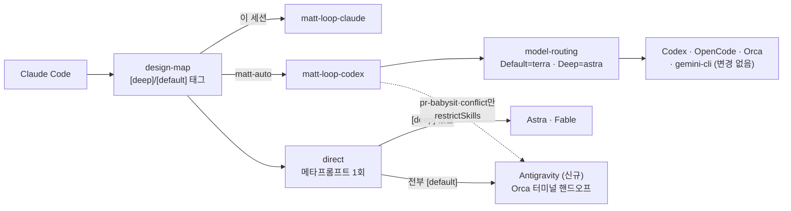
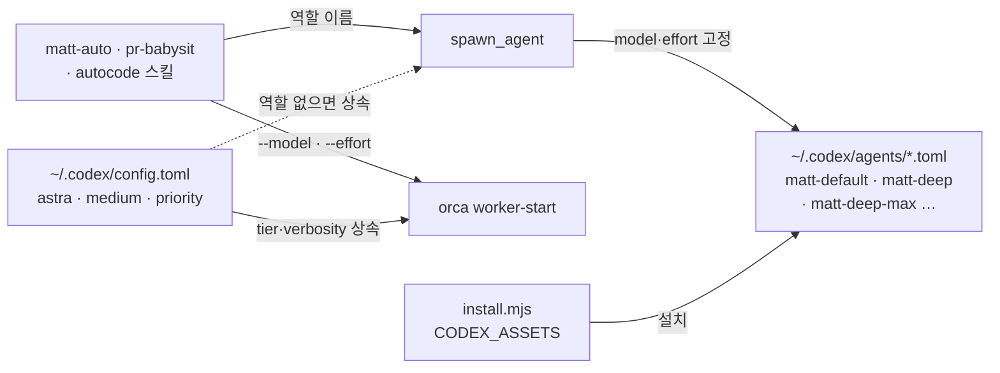

# Antigravity 수신자 편입과 Codex 역할 파일 라우팅

추천: matt-auto — 9단계, deep 3 · default 6. 이 머신의 Claude Code에는 matt-loop Claude판이 없으므로 "이 세션"은 direct 프로토콜(실행 프롬프트를 먼저 쓰고 단계별 verify)로 진행하고, 서로 독립인 `[default]` 단계는 Workflow pipeline으로 병렬화한다.

- 날짜: 2026-09-07
- 대상: weed-harness 5.2.0 → 5.3.0, matt-loop 3.1.0 → 3.2.0, auto-loop 4.1.0 → 4.2.0
- 설계 페이지: https://claude.ai/code/artifact/8ee497fa-1b22-4a20-abb9-5625ae05972c

## 큰 틀

두 가지를 한 번에 바꾼다. 첫째, **Antigravity**를 새 설치 플랫폼이자 design-map `direct` 루프의 두 번째 수신자로 편입한다. 새 plugin root는 만들지 않는다: `bin/install.mjs`에 `antigravity` 플랫폼 키를 추가하고, PLUGINS 항목에 플랫폼별 allow-list `restrictSkills`를 두어 matt-loop는 `pr-babysit`·`resolving-merge-conflicts` 두 스킬만, auto-loop는 아무것도 설치하지 않는다(두 스킬은 이미 `plugins/matt-loop-codex/skills/`에 정확한 사본이 있다). design-map 6단계 추천 표의 `direct` 행을 "3–6단계, 테스트 적음"으로 넓히고 수신자 규칙을 넣는다 — 구현 순서에 `[deep]` 단계가 하나라도 있으면 Astra/Fable, 전부 `[default]`(기계적·문서 전용)면 Antigravity — 그리고 8단계에 Codex/OpenCode와 같은 Orca 터미널 핸드오프 분기를 추가한다. 메타프롬프트 문장은 수신자와 무관하게 같으므로 Antigravity 쪽에 `implement` 같은 스킬을 설치할 필요가 없다. gemini-cli 플랫폼과 vendored `handoff` 스킬은 건드리지 않는다.

둘째, **Codex 라우팅의 값을 스킬 문장에서 역할 파일로 옮긴다.** `plugins/matt-loop-codex/codex/agents/{matt-default,matt-deep,matt-deep-max}.toml`과 `plugins/auto-loop-codex/codex/agents/{experimenter-default,experimenter-deep,strategist,strategist-max}.toml`이 model·effort(·Default 역할은 `model_verbosity = "low"`·standard service tier)를 고정하고, install.mjs의 CODEX_ASSETS 표가 codex 플랫폼에서만 `~/.codex/agents/`로 복사한다. 역할 파일의 값은 spawn 인자보다 우선하므로 사용자 config의 `service_tier = "priority"`가 백그라운드 워커로 새지 않는다. 스킬(model-routing · pr-babysit · resolving-merge-conflicts · matt-auto · autocode)은 역할 이름으로 `spawn_agent`하고, 역할이 없으면 `$model-routing` 표의 쌍으로 spawn하고 한 번 보고한다(폴백 문장에 model·effort 값을 다시 적지 않는다). 사다리의 `max` 재시도는 `matt-deep-max` / `strategist-max` 역할로 오른다. Orca `worker-start`는 `--model`/`--effort`만 받으므로 그 워커는 사용자 tier를 그대로 내며, 이 갭은 고치지 않고 model-routing에 명시한다. luna 티어는 만들지 않는다. 프롬프트 캐시 규율(안정 preamble 먼저·티켓 꼬리 마지막, 실행 중 effort 변경 금지, 워커 compaction 한도 낮추지 않기)과 `[agents]` 전역 기본값은 문서화만 하고 사용자 config.toml은 절대 자동으로 쓰지 않는다. 모든 스킬 변경은 `bin/check-words.mjs`의 상한 안에서 끝나며, 상한은 올리지 않는다.

## 목표

1. `node bin/install.mjs --dry-run --yes --no-unlazy --platforms antigravity --plugins all --home <tmp>`가 weed-harness 공통 스킬 5개(setup·design-map 제외) + matt-loop의 `pr-babysit`·`resolving-merge-conflicts`만 나열하고 auto-loop는 `! auto-loop: skipped for antigravity`를 찍으며 exit 0이다. `--platforms claude-code`·`opencode`·`orca`·`gemini-cli`의 dry-run 출력은 변경 전(`<tmp>/before/<platform>.txt`, 이미 저장됨)과 diff가 없고, `codex`는 `routing agent roles` 두 줄이 추가된 것만 다르다.
2. `--platforms codex`로 `--home <tmp>`에 실제 설치하면 `<tmp>/.codex/agents/`에 7개 `.toml`이 생기고, 각 파일은 `name`·`description`·`developer_instructions`·`model`·`model_reasoning_effort`를 가진다. matt-default·experimenter-default는 `model_verbosity = "low"`와 standard tier 키를 가진다(E3·E4 probe 결과에 따라 키를 빼고 기록). opencode 설치는 `~/.config/opencode/command/`를 계속 만들고, codex 설치는 만들지 않는다.
3. Codex판 SKILL.md(matt-auto·pr-babysit·resolving-merge-conflicts·autocode)와 `skills/model-routing/SKILL.md`에서 `grep -rn 'reasoning_effort: "'`가 0건이고, 역할 이름(matt-default·matt-deep·matt-deep-max·experimenter-default·experimenter-deep·strategist·strategist-max)으로 spawn한다. `node bin/check-words.mjs`가 통과한다.
4. `skills/design-map/SKILL.md`의 6단계 표 `direct` 행이 "3–6단계, 테스트 적음 → `direct`; `[deep]` 있으면 Astra/Fable, 전부 `[default]`면 Antigravity"이고, 8단계에 antigravity 분기(`--command antigravity`, 프롬프트 감지, 60초 초과 시 명령만 출력)가 있다.
5. `plugins/matt-loop-codex/skills/matt-auto/orca-worker-prompt.md`에 안정 preamble 먼저·티켓 꼬리 마지막 규칙 한 줄이 있다. 루트 README에 antigravity 플랫폼 행이, `plugins/matt-loop-codex/README.md`에 Codex `[agents]` 스니펫(default_subagent_model=gpt-5.6-terra, default_subagent_reasoning_effort=medium, max_concurrent_threads_per_session=4, compaction 주의, service_tier 전역 트레이드오프)과 그 아래 luna 실험 후보 한 줄이 있다.
6. 버전: weed-harness 5.3.0 · matt-loop 3.2.0 · auto-loop 4.2.0, `node bin/check-versions.mjs`와 `npm test` 통과.

## 비목표

- gemini-cli 플랫폼의 범위·경로를 바꾸지 않는다. Claude판(`plugins/*-claude`)과 OpenCode 에이전트 파일·명령 생성은 바꾸지 않는다.
- vendored Matt 스킬(`handoff`·`implement`·`tdd` 등)의 내용을 바꾸지 않는다. Astra 가이드의 "되돌릴 수 있는 변경엔 테스트 생략" 규칙은 넣지 않는다.
- luna 티어, model-routing의 3번째 티어, Orca `worker-start`의 tier·verbosity 전달은 만들지 않는다.
- 사용자의 `~/.codex/config.toml`을 install.mjs가 읽거나 쓰지 않는다.
- 단어 상한(`bin/check-words.mjs`)을 올리지 않는다. 상한이 가까운 파일에서는 문장을 더한 만큼 뺀다.

## 확정 구조

## 결정

| id | 질문 | 선택 | 이유 |
|---|---|---|---|
| E1 | Orca가 antigravity CLI를 터미널로 구동할 수 있나? | **probe 결과(2026-09-07)**: `orca terminal create --worktree path:<repo> --command antigravity --json`·`read --screen`·`close` 모두 성공 — 매커니즘은 검증됨. 그러나 이 머신에는 `antigravity` 바이너리가 PATH에 없어 화면에 `Command 'antigravity' not found, but can be installed with: sudo snap install antigravity`가 찍혔다. idle 프롬프트 문자열은 미기록; design-map 8단계는 "첫 probe에서 기록한 프롬프트, 없으면 60초 안의 화면 변화" 폴백으로 둔다. 실제 CLI 이름·설치 경로는 사용자 확인 필요 | Orca 쪽은 확인됐고, antigravity 쪽 CLI 존재가 미확인 |
| E2 | Antigravity가 프로젝트 지침 파일을 자동으로 읽나? | gemini-cli처럼 네이티브 discovery 없음으로 가정, `~/.antigravity/skills`에 설치하고 note에 수동 참조를 적음 | 설정 파일 규칙이 확인되지 않음 |
| E3 | `service_tier`의 standard 값, 역할 파일의 키 지원, priority 배수는? | 역할 파일에 standard tier를 시도하고 3단계 probe로 검증. 못 받으면 키를 빼고, config.toml은 전역이라 "어디서나 priority / 어디서나 standard" 트레이드오프를 README에 적음 | 검증된 2×는 fast 기준, priority 배수와 키 지원은 문서에 없음 |
| E4 | `model_verbosity`를 역할 파일이 존중하고 terra가 지원하나? | Default 역할에만 `low`, 3단계 probe로 검증, 안 되면 빼고 기록 | 문서는 "GPT-5 Responses API verbosity"라고만 적음 |
| E5 | 하네스 `max` ↔ Codex effort 이름은? | `matt-deep-max`·`strategist-max`의 effort는 Codex가 광고하는 최상위 값(`xhigh` 우선)으로 채우고 기록 | config 문서는 minimal~xhigh, 서브에이전트 문서는 ~max/ultra |
| E6 | `.codex-plugin/plugin.json`이 역할 파일을 실을 수 있나? | 스킬에 폴백 한 줄: 역할이 없으면 `$model-routing` 표의 쌍으로 spawn하고 한 번 보고(값은 다시 적지 않음) | 매니페스트는 `skills`만 가리킴 |
| D1 | antigravity 스킬 범위는 어디에? | 새 root 없이 matt-loop-codex에서 `pr-babysit`·`resolving-merge-conflicts`만 install.mjs가 골라 설치 | 정확한 사본이 이미 있고, 3번째 동기화 대상은 드리프트 위험 |
| D2 | auto-loop도 antigravity에? | 아니오 — `restrictSkills: { antigravity: [] }` | 실험 루프는 범위 밖 |
| D3 | gemini-cli도 손보나? | 아니오 | 별도 대상으로 확정, 변경 요청 없음 |
| D4 | antigravity를 model-routing 티켓 디스패치에? | 아니오 — design-map `direct`의 수신자로만 | 무상태 병렬 디스패치와 라이브 단일 세션은 형태가 다름 |
| D5 | `direct`의 수신자 규칙은? | `direct` 행을 "3–6단계, 테스트 적음"으로 넓히고: `[deep]` 하나라도 → Astra/Fable, 전부 `[default]` → Antigravity | 기존 태그 재사용; 기존 행("core is `[deep]`")으로는 전부 `[default]`인 spec이 `direct`에 닿지 않음 |
| D6 | antigravity에 `implement`를 설치하나? | 아니오 | 메타프롬프트가 self-contained |
| D7 | vendored `handoff`를 고치나? | 아니오 — design-map 6·8단계만 | 업스트림 동기화 파일 |
| D8 | install.mjs 일반화는? | PLUGINS에 `restrictSkills: { <platform>: [...] }` allow-list 추가; `[]`는 그 플랫폼에서 플러그인 skip(실패 아님), undefined는 필터 없음, 기존 "no skills found" 실패는 유지 | 다른 플랫폼에 영향 없는 추가 필드 |
| D9 | Codex 라우팅 값은 어디에? | 역할 파일 7개 + CODEX_ASSETS → `~/.codex/agents/`; 스킬은 역할 이름으로 spawn | 역할 값이 spawn보다 우선, 단어 상한에 문장 자리 없음, Claude·OpenCode와 같은 패턴 |
| D10 | luna 3번째 티어? | 아니오 — matt-loop-codex README의 `[agents]` 스니펫 아래 한 줄로만 기록 | 재시도 비용이 절감분을 먹음; 상한 파일에는 자리 없음 |
| D11 | 워커 service tier? | 역할 파일에 standard; 사용자 세션만 priority | 기다리는 사람이 없는 워커의 웃돈 |
| D12 | verbosity? | Default 역할만 `low` | 워커 산문은 아무도 안 읽음 |
| D13 | 캐시 규율? | preamble 먼저·꼬리 마지막(한 줄), 실행 중 effort 변경 금지(기존), compaction 한도 낮추지 않기(README) | 30분 prefix 캐시는 웨이브·연속 티켓에서 갚음 |
| D14 | `[agents]` 전역 기본값? | README 스니펫만; install.mjs는 config.toml을 쓰지 않음 | 사용자 소유 파일 |
| D15 | 단어 상한? | 파일별 순증 예산: model-routing ≤ +3, matt-auto ≤ +2, autocode ≤ +1, 체인 ≤ +15; 더한 만큼 이름 붙은 문장을 뺀다 | 넘치면 역할 파일 description으로 |
| D16 | 역할이 effort를 고정하면 `max` 재시도는? | `matt-deep-max`·`strategist-max` 역할 | spawn 인자로 역할 값을 못 넘음 |
| D17 | Orca 워커의 tier·verbosity 갭? | 수용, model-routing Orca 줄에 명시 | 플래그가 없음 |
| D18 | 역할 이름? | OpenCode·Claude 에이전트 파일과 동일 | 플랫폼 분기 불필요 |

## 구현 순서

1. `[default]` **install.mjs — antigravity 플랫폼과 restrictSkills (D1·D2·D8·E2)**: PLATFORMS에 `antigravity` (`~/.antigravity/skills`, note: "no native skill discovery confirmed — reference the skill files yourself; the loop plugins install only the shared PR skills here"); PLUGINS의 matt-loop에 `restrictSkills: { antigravity: ["pr-babysit", "resolving-merge-conflicts"] }`, auto-loop에 `restrictSkills: { antigravity: [] }`; 설치 루프에서 `skillDirs` **앞에** `restrictSkills?.[platform]`을 본다 — `[]`면 `! <plugin>: skipped for <platform>`을 찍고 `continue`(failures 증가 없음), 배열이면 `claudeOnlySkills` 필터 뒤에 allow-list를 적용, undefined면 필터 없음; 기존 "no skills found" 실패는 그대로 둔다. legacy 목록·`installedSkillName`·`normalizeOpenCodeSkill`은 손대지 않는다(이미 비-claude 플랫폼은 setup·design-map을 legacy로 취급하고, 정규화는 opencode 전용). 헬프 문구의 플랫폼 목록은 `Object.keys(PLATFORMS)`라 자동 갱신 → 확인: 목표 1의 antigravity dry-run 출력(5 + 2 스킬, skipped 줄, exit 0); `claude-code`·`opencode`·`orca`·`gemini-cli` dry-run이 `<tmp>/before/<platform>.txt`와 diff 없음.
2. `[default]` **install.mjs — CODEX_ASSETS (D9)**: OPENCODE_ASSETS와 같은 모양의 `CODEX_ASSETS = { "matt-loop": [{ src: plugins/matt-loop-codex/codex/agents, dir: ~/.codex/agents, desc: "routing agent roles" }], "auto-loop": [{ src: plugins/auto-loop-codex/codex/agents, … }] }`; 설치 루프의 자산 복사 부분만 `PLATFORM_ASSETS = { opencode: OPENCODE_ASSETS, codex: CODEX_ASSETS }`로 공유하고(dry-run 출력 규칙 동일), `installOpenCodeCommands`와 그 dry-run 줄은 `platform === "opencode"`에 남긴다 → 확인: `--dry-run --platforms codex --plugins all`에 `✓ matt-loop/routing agent roles`·`✓ auto-loop/routing agent roles`가 찍히고 그 두 줄을 빼면 `before/codex.txt`와 diff 없음; `--home <tmp>` 실제 설치 뒤 `ls <tmp>/.codex/agents/*.toml`이 7개이고 `<tmp>/.config/opencode/command`는 없다. (3단계 뒤에 실행 — 역할 파일이 있어야 dry-run이 찍힌다.)
3. `[deep]` **Codex 역할 파일 7개 (D9·D11·D12·D16·D18·E3·E4·E5)**: `plugins/matt-loop-codex/codex/agents/{matt-default,matt-deep,matt-deep-max}.toml`, `plugins/auto-loop-codex/codex/agents/{experimenter-default,experimenter-deep,strategist,strategist-max}.toml`. 각각 `name`·`description`(Claude 에이전트 파일의 description과 같은 문장)·`developer_instructions`(OpenCode/Claude 에이전트 본문 + 무인 실행 문단)·`model`·`model_reasoning_effort`(default: gpt-5.6-terra/medium, deep: gpt-6-astra/high, max: gpt-6-astra/최상위, strategist: astra/high). Default 역할에 `model_verbosity = "low"`와 standard `service_tier`. **Probe**: 파일을 `~/.codex/agents/`에 두고 `codex` 세션에서 (a) spawn_agent 스키마에 7개 역할이 보이는지, (b) `matt-default` 스폰 1회의 요청 모델이 terra인지(`~/.codex/sessions` 로그), (c) `service_tier`·`model_verbosity` 키가 거부되는지 → 확인: (a)(b) 참; (c)의 결과를 E3·E4 행과 README에 기록하고 거부된 키는 파일에서 뺀다; 거부된 effort 이름은 E5에 따라 바꾼다.
4. `[deep]` **model-routing SKILL.md (D9·D15·D17·E6)** — 순증 ≤ +3 단어: "Dispatch per platform → Codex"(27행, 52단어)를 "역할 이름으로 `spawn_agent`(`matt-default` / `matt-deep` / `matt-deep-max`; autocode는 `experimenter-default` / `experimenter-deep` / `strategist` / `strategist-max`), `fork_turns: "none"`, `ROUTED_EXECUTION=1`; 역할이 없으면 표의 쌍으로 spawn하고 한 번 보고. 역할 파일이 Default의 standard tier와 `model_verbosity: low`를 고정한다"로 바꾸되 "Inspect available schemas; if continuation is unavailable, replace with a context handoff." 문장을 빼서 상쇄; Ladder(21행)의 "Codex `max` once"를 "`matt-deep-max` / `strategist-max` once"로; Orca 줄(30행) 끝에 "Orca workers pay the user's tier and verbosity."를 더하고 19행의 날짜 괄호 "(2026-09-06)"를 뺀다; 안정 prefix 규칙은 여기 넣지 않는다(6단계) → 확인: `node bin/check-words.mjs` 통과(model-routing ≤ 700); `grep -c 'reasoning_effort' skills/model-routing/SKILL.md` = 0.
5. `[default]` **Codex판 스킬 4개 (D9·D16·E6)** — 순증 matt-auto ≤ +2, autocode ≤ +1: `pr-babysit` 35행과 `resolving-merge-conflicts` 10행의 `model: "gpt-…"`, `reasoning_effort: "…"` 쌍을 각각 `matt-default` / `matt-deep` 역할 이름으로(폴백은 "role missing → the tier's pair from `$model-routing`, reported once" 한 구절, 값 없음); `pr-babysit` 45행과 `matt-auto` 66행의 "`max`-effort retry" / "at `max` effort"를 "`matt-deep-max`"로; `autocode` 57·176행의 `reasoning_effort: "max"`와 102·215행의 "`max`"를 `strategist-max` 역할로(219행의 "Codex `max` retry"도 같은 이름), 폴백 구절은 3H 표의 Strategist (escalated) 행 안에 넣고 새 줄을 만들지 않는다 → 확인: `grep -rn 'reasoning_effort: "' plugins/matt-loop-codex/skills plugins/auto-loop-codex/skills` 0건; `node bin/check-words.mjs` 통과(matt-auto ≤ 3800, autocode ≤ 4250, 체인 ≤ 8700).
6. `[default]` **orca-worker-prompt.md (D13)**: 첫 문단 뒤에 "Order the routed prompt with the stable part first — the skill text and this preamble — and the ticket-specific tail last; the prefix is what the 30-minute prompt cache reuses across a wave." 한 줄(이 파일은 상한 없음) → 확인: `grep -c "prompt cache" plugins/matt-loop-codex/skills/matt-auto/orca-worker-prompt.md` = 1.
7. `[deep]` **design-map SKILL.md (D5·D7·E1)**: 316행의 `direct` 행을 "| 3–6 steps, few tests | `direct` — one live session plans and builds the whole spec; any `[deep]` step → Astra / Fable, all `[default]` → Antigravity; cheaper workers would not repay matt-auto's fixed cost |"로; 8단계 2의 "어디서 실행" 선택지에 Antigravity(spec이 전부 `[default]`일 때 추천), 4의 Orca 터미널 흐름에 `--command antigravity` 분기 — 프롬프트 감지 문자열은 E1 probe에서 읽은 값, 없으면 60초 안의 화면 변화, 초과 시 명령만 출력 —, 5의 보고에 동일 적용; direct 메타프롬프트 문장은 그대로 → 확인: `grep -c -i antigravity skills/design-map/SKILL.md` ≥ 3; **E1 probe**: Orca 안에서 `<bin> terminal create --worktree path:<repo> --command antigravity --json`을 1회 실행하고, 성공하면 `<bin> terminal read --terminal <handle> --screen --json`으로 idle 프롬프트 문자열을 읽어 E1 행과 8단계 문장에 적은 뒤 그 터미널을 닫는다; 실패하면 오류를 E1 행에 기록하고 분기는 "명령만 출력" 폴백으로 남긴다.
8. `[default]` **문서 (D3·D10·D13·D14·E2·E3)**: 루트 README 플랫폼 표에 `antigravity` 행(`~/.antigravity/skills/`, "loop plugins install only the shared PR skills; no native discovery confirmed"), `plugins/matt-loop-codex/README.md`에 `[agents]` 스니펫(`default_subagent_model = "gpt-5.6-terra"`, `default_subagent_reasoning_effort = "medium"`, `max_concurrent_threads_per_session = 4`), 워커 역할에 낮은 `model_auto_compact_token_limit`을 두지 말 것, `service_tier`가 전역이라는 트레이드오프, 그리고 그 아래 luna 실험 후보 한 줄; `docs/SKILL_MAP.md`의 플랫폼·자산 표 갱신 → 확인: `grep -n antigravity README.md docs/SKILL_MAP.md`가 각 1건 이상; `grep -c "default_subagent_model\|luna" plugins/matt-loop-codex/README.md` = 2.
9. `[default]` **버전 범프**: 5.3.0 — `.claude-plugin/plugin.json`, `.codex-plugin/plugin.json`, `package.json`, `.claude-plugin/marketplace.json`의 루트 `version`과 weed-harness 항목; 3.2.0 — `plugins/matt-loop-claude/.claude-plugin/plugin.json`, `plugins/matt-loop-codex/.codex-plugin/plugin.json`, marketplace의 matt-loop 항목; 4.2.0 — auto-loop의 같은 세 곳; "Requires weed-harness 5.0+"는 유지 → 확인: `node bin/check-versions.mjs` 통과(5.3.0 / 3.2.0 / 4.2.0); `npm test` 통과.

순서 제약: 3 → 2·4·5(역할 파일과 이름이 먼저 존재해야 함); 1·6·7·8은 서로와 3에 대해 독립; 9는 마지막.
