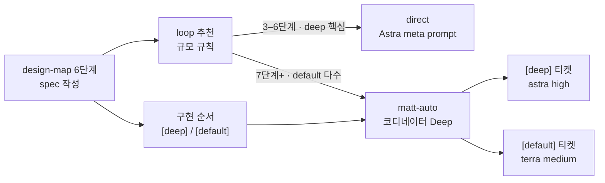

# design-map 루프 추천과 단계별 모델 태그

추천: direct — 4단계, deep 1 · default 3. 실제로는 이 세션(Fable)에서 바로 구현했다.

## 큰 틀

모델이 강해질수록 scaffolding은 줄어야 한다. Astra 위에 matt-auto의 전체 파이프라인(인터뷰 · 보드 · 원장)을 얹는 것은 고정비만 내는 일이고, terra 같은 싼 모델은 그 파이프라인의 검증 루프가 있어야 믿을 수 있다. 그래서 design-map은 spec을 쓰는 시점에 두 가지를 추천한다. (1) spec 규모로 루프를 고른다: 한 파일이면 `implement`, 어려운 로직이 핵심인 3–6단계면 `direct`(강한 모델 한 세션이 meta prompt로 계획 → 실행 → 검증), 7단계 이상이거나 병렬 가능하고 대부분 기계적이면 `matt-auto`(terra 티켓, 코디네이터와 위임자는 Deep), 숫자를 움직이면 `autocode`. (2) 구현 순서의 각 단계에 `[deep]` / `[default]` 태그를 붙여 matt-auto가 티켓 티어를 다시 판단하지 않고 그대로 읽게 한다. 두 추천은 8단계의 한 번 질문에 근거 한 줄과 함께 나온다. Codex의 Default 페어는 terra로 내려가고, Deep과 `max` 재시도는 astra에 남는다.

## 목표 / 비목표

- 목표: 토큰 효율. 어려운 부분은 Astra, 테스트·보일러플레이트는 terra, 작은 일은 matt-auto 없이.
- 비목표: direct와 matt-auto를 한 spec 안에서 섞는 하이브리드 경로. 섞인 spec은 `matt-auto` + 태그로 해결한다.
- 비목표: Claude Code · OpenCode 라우팅 표 변경. OpenCode는 이미 terra/sol, Claude Code는 opus/fable 그대로.

## 확정 구조

## 결정

| id | 질문 | 선택 | 이유 |
|---|---|---|---|
| D1 | 분기 기준은 플랫폼인가 spec인가 | spec frontmatter `loop`에 `direct`를 추가 | 플랫폼 조건이면 design-map이 경로를 둘 들고 다녀야 한다. `implement`는 "한 파일 30분"으로 남긴다 |
| D2 | Codex Default 페어 | gpt-5.6-terra / medium (Deep · max는 astra) | Codex `models_cache.json`에 terra가 있다. 사다리 한 단(Default → Deep)이 그대로 terra → astra 승급이 된다. diet-b D1의 "모델 하나" 근거는 뒤집히고 2티어는 유지 |
| D3 | meta prompt는 누가 쓰나 | 받는 세션이 spec에서 자기 실행 프롬프트를 먼저 써서 보여준 뒤 실행 | design-map이 자유 작문하면 spec과 두 벌이 된다. 계획이 보이는 체크포인트가 grill log와 같은 역할. 루프 밖이라 Astra `ultra` 위임도 쓸 수 있다 |
| D4 | 단계별 모델은 누가 정하나 | design-map이 구현 순서에 `[deep]` / `[default]` 태그, matt-auto `--spec`은 태그를 티어로 읽음 | `--spec`이 인터뷰를 미리 채우듯 티켓 분류도 미리 채운다. 태그 수가 추천의 근거가 된다 |
| D5 | 경계값 | 1–2 / 3–6 / 7+ 단계 | 출발점. 같은 spec을 두 경로로 돌려 본 뒤 조정한다 |
| D7 | autocode `init --spec`도 같은가 | 같다. metric 블록이 채우는 키 외에는 기본값(N/20, parallel 2, pr_base 현재 브랜치, scope module), follow-up은 recon으로, 승인 질문도 spec으로 통과 | D6과 같은 이유. unlazy 원장 approve(loop-gates 규약)는 명령 실행 동의라 그대로 둔다 |
| D6 | matt-auto `--spec`이 인터뷰를 다시 하나 | 하지 않는다. design-map의 self-grill과 사용자 확정이 인터뷰였고, 인터뷰 게이트는 spec으로 자동 통과(`--confirm`만 복원) | 같은 질문을 두 번 묻는 건 고정비만 늘린다. 남은 질문은 to-spec · to-tickets 단계에서 위임자에게 가고, spec 결정을 뒤집는 것만 `design override`로 에스컬레이션 |

## 구현 순서

1. `[deep]` `skills/model-routing/SKILL.md` — Codex Default = gpt-5.6-terra, dispatch와 Orca 플래그를 "티어의 모델"로. verify: `node bin/check-words.mjs` (700 cap).
2. `[default]` `skills/design-map/SKILL.md` — `loop: direct`, 추천 표, 단계 태그, direct handoff 라인. verify: `grep -c direct` > 0, 8단계 문장 읽기.
3. `[default]` matt-auto 두 에디션 · pr-babysit(Codex) — 태그를 티어로 읽는 한 문장, Default 스폰 모델 terra. verify: `node bin/check-words.mjs`.
4. `[default]` README · SKILL_MAP · diet-b 대조표 후기. verify: `npm test`.
5. `[default]` matt-auto 두 에디션 4단계 — `--spec`이면 인터뷰와 게이트 생략, `⏭️ design-map spec`; interview-report note 예시. verify: `node bin/check-words.mjs`.
6. `[default]` autocode 두 에디션 2B/2F — `--spec`이면 인터뷰·승인 질문 생략; reference.md 안내 한 줄. verify: `node bin/check-words.mjs`.
